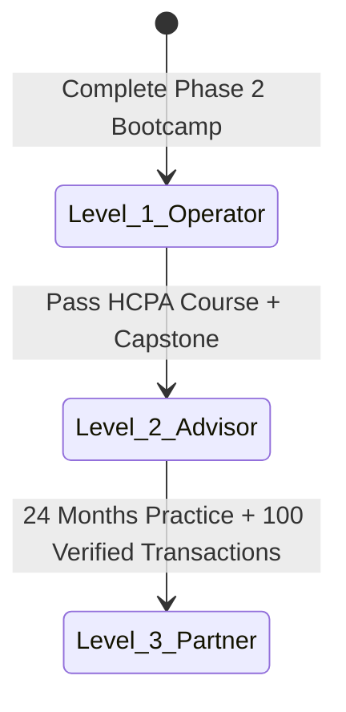

# MODULE 10: Capstone & Certification

## Handbook 2: The Final Examination & Certification Standards

*"Certification is not the end of learning; it is the beginning of professional responsibility."*

### Opening Story
In a room filled with real estate brokers, two individuals stood out.

The first broker had a business card listing ten different certifications from various international bodies. However, when asked about the latest land registration process in Lagos State, he could not answer. He rarely attended training programs, believing his past experience was enough.

The second broker was a Housmata Certified Property Advisor (HCPA). She held a Level 2 certificate. She spent one weekend every quarter attending Continuing Professional Development (CPD) masterclasses, learning about new zoning laws, mortgage policies, and digital transaction security. Her knowledge was current, her advice was accurate, and her clients always had the competitive edge.

The HCPA designation is not a trophy on a shelf. It is a commitment to continuous excellence and ethical practice.

---

### Learning Objectives
By the end of this handbook, you should be able to:
- Prepare effectively for the Final Written Examination.
- Understand the requirements for different Housmata Certification levels.
- Sign off and commit to the Housmata Code of Ethical Practice.
- Log and track your Continuing Professional Development (CPD) credits.

---

### Lesson 1: The Final Written Examination

The written exam evaluates your theoretical knowledge across all modules. It is administered online under secure, proctored conditions.

#### Exam Structure:
- **Section A: Multiple Choice (40%):** 50 questions covering titles, mortgages, land banking mathematics, zoning laws, and CRM workflows.
- **Section B: Scenario Analysis (30%):** Short-answer questions requiring you to diagnose financial or documentation errors in mock client case files.
- **Section C: Ethical Essay (30%):** Case studies testing your adherence to the "People Before Property" philosophy under conflicting business pressures.

*Passing Standard:* A minimum score of **70%** is required to pass the written exam.

---

### Lesson 2: Housmata Certification Levels

The Academy offers a structured career ladder. Your certification level defines your role and privileges within the Housmata ecosystem:

#### Level 1: Digital Property Management Operator (L1)
- **Role:** Handles day-to-day operations: tenant onboarding, rent tracking, maintenance tickets, and basic reporting.
- **Target Audience:** Estate managers, administrative assistants.

#### Level 2: Housmata Certified Property Advisor (HCPA) (L2)
- **Role:** Full advisory rights: conducting consultations, running coordinate searches, preparing due diligence reports, structuring mortgages, and closing sales.
- **Target Audience:** Independent consultants, lead advisors.

#### Level 3: Senior Portfolio Manager & Partner (L3)
- **Role:** Evaluates developer joint ventures, structures commercial portfolios for institutional clients, and leads regional advisor teams.
- **Target Audience:** Agency heads, development directors.

---

### Lesson 3: The Code of Ethical Practice

Upon passing your exams, you must sign the **Housmata Oath of Professional Conduct**. Violation of this oath leads to immediate revocation of your certification.

#### Key Pledges of the Oath:
1. **The Verification Duty:** I will never market, recommend, or accept commission for any property whose coordinate search and legal title status have not been verified.
2. **People Before Commission:** I will always recommend the property that matches my client's objective, even if it carries a lower commission than other options.
3. **Radical Transparency:** I will declare all transaction costs, developers' records, and potential physical defects of a property to my client before they make any payment.
4. **Professional Boundaries:** I will never act as a lawyer or surveyor; I will always advise my clients to retain licensed specialists to sign off on legal titles and boundaries.

---

### Lesson 4: Continuing Professional Development (CPD)

The real estate market is constantly changing. New government laws are enacted, tax policies change, and financing platforms evolve. To maintain your HCPA active status, you must log **10 CPD credits** every calendar year:

- **Attending Masterclasses:** 2 credits per session.
- **Publishing Market Research Reports:** 3 credits per report.
- **Facilitating Academy Training:** 4 credits per module.

---

### Chapter Summary
- The final written exam consists of multiple-choice, scenario-diagnosis, and ethical essays.
- The certification ladder transitions from L1 Operator to L2 Certified Advisor, and finally L3 Senior Partner.
- Every certified professional must sign and uphold the Housmata Oath of Professional Conduct.
- Active certification requires logging 10 Continuing Professional Development (CPD) credits annually.

---

### End-of-Chapter Reflection
*Read the Housmata Oath of Professional Conduct. Are you prepared to lose a ₦5 million commission by telling a client about a hidden title defect that you discovered?* Write your honest commitment and thoughts in your journal.
