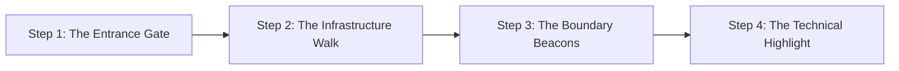

# MODULE 11: Site Inspection Excellence

## Handbook 2: Presentation & Storytelling on Site

*"Amateurs show land; professionals paint the future."*

### Opening Story
An agent took a client to inspect a plot of land in Epe. The land was covered in high grass and shrubs. The agent stood by the road, pointed at the bush, and said: *"This is the plot. It is 600 square meters. The price is ₦10 million. It's a good investment."* 

The client looked at the bush, saw only spiders and grass, and felt uninspired. He said he would "think about it" and left.

A Housmata Certified Advisor took the same client to the adjacent plot. Before entering the land, the advisor stood at the estate boundary:
*"Mr. Cole, look at that cleared stretch 300 meters away. That is the route of the new 4-lane regional road connecting Epe to the Free Trade Zone. In three years, this estate will have a direct exit onto that highway.*

*Let's walk to the plot boundary.* (They walk to the concrete beacon). *Stand here. In your mind, place your living room window facing east. You will have a clear, uninterrupted view of the estate's green park. The developer has set back this row of plots to ensure no building will block your morning sunlight."*

The client did not see a bush anymore. He saw a home and a high-yield asset. He bought it the next day.

---

### Learning Objectives
By the end of this handbook, you should be able to:
- Apply professional presentation standards during site tours.
- Use storytelling to help clients visualize raw land's future value.
- Structure a site tour step-by-step, from the gatehouse to the boundary beacons.
- Highlight technical due diligence details as value props on-site.

---

### Lesson 1: Visual and Verbal Presentation Standards

Your presentation on-site must project competence and trust:

- **Dress Code:** Smart-casual and professional. Branded Housmata shirts, clean jeans, and durable site boots. Avoid suits on raw land, and never wear slippers or casual shorts.
- **Body Language:** Walk with confidence. Lead the client; do not follow behind them. Keep eye contact when explaining features.
- **Verbal Professionalism:** Avoid slang or hype. Do not say: *"This land is blowing up! You will make billions next year!"* Say: *"The historic appreciation data for this corridor shows an average compounding growth rate of 28% over the last four years, driven by the Deep Sea Port construction."*

---

### Lesson 2: The Art of Property Storytelling

Undeveloped land looks boring to the untrained eye. Your job is to **paint the future**.

#### How to Structure Your Story:
1. **The Context (The Past & Present):** Explain what the area used to be and what it is today. Contrast the growth.
2. **The Catalyst (The Infrastructure):** Identify the specific road, port, or commercial hub driving the change. Point toward it if possible.
3. **The Vision (The Future Lifestyle/Yield):** Describe the future estate. Help them see the paved roads, the streetlights, and their own building layout.

---

### Lesson 3: The Step-by-Step Tour Flow

Never wander aimlessly on-site. Structure the walkthrough like a narrative:

#### Step 1: The Entrance Gate (First Impression)
Stop at the gatehouse or boundary entrance. Discuss the developer's security plan, perimeter fencing, and entrance design. This sets the boundary of the "protected zone."

#### Step 2: The Infrastructure Walk
Walk along the internal road layout. Point out drainage channels, electricity layouts, and communal green spaces. This proves the developer is actively investing in site services.

#### Step 3: The Boundary Beacons
Stand directly at the client's proposed plot. Find the concrete beacons and verify the number. Walk the perimeter of the plot to give them a physical sense of space.

#### Step 4: The Technical Highlight
Point out a specific due diligence detail: the soil type, the elevation compared to the road, or compliance with setbacks. This reinforces that you are verifying, not just selling.

---

### Case Study: The Visual Soil Check

> [!NOTE]
> **Scenario:** Advisor Fatima was showing a client a plot in an estate. The client was concerned about hidden swampy conditions. 
> 
> **Fatima's Action:** Fatima walked the client to the center of the plot. She took a handheld soil auger (or a shovel) from her site kit and dug a small hole, showing the sandy, firm texture of the soil:
> *"Mr. Kenneth, see this soil? It is sandy-loam. It has excellent bearing capacity and natural drainage. This means you will not need expensive piling or deep sand-filling for your foundation, saving you at least ₦8 million in construction costs compared to plots 2km down the road."*
> 
> **Outcome:** The client's fear was resolved. He saw that the Advisor understood construction reality and was not hiding defects. He bought the plot.
> 
> **Lesson:** Bringing physical proof (like soil checks or GPS readings) on-site builds unshakeable credibility.

---

### Chapter Summary
- Storytelling bridges the gap between raw bush and a client's future wealth or home.
- A structured site tour moves from the gate (security) to the beacons (possession).
- Technical highlights (soil checks, setbacks, drainage) are the ultimate value props.
- Professional presentation on-site projects authority and commands respect.

---

### End-of-Chapter Reflection
*Write a short story script (2 paragraphs) that you would use to present a raw, undeveloped plot of land in Epe to an investor looking for long-term wealth.* Practice speaking it aloud.
