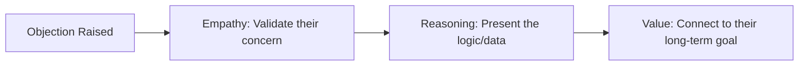

# MODULE 11: Site Inspection Excellence

## Handbook 3: Handling Objections, Closing & Follow-up

*"The sale does not close on site; it closes in the follow-up."*

### Opening Story
An advisor conducted a site tour with a couple looking for a plot to build a retirement home. During the inspection, the husband raised an objection: *"The road to this estate is unpaved, and the area feels too far from the city center."*

The advisor became defensive: *"But Epe is developing fast! You should buy now before the price goes up!"* 

The couple felt pressured and ignored. They cut the conversation short and left.

Another advisor, faced with the same objection from a different client, replied calmly:
*"I completely agree with you, sir. The access road is currently ungraded, and it feels remote today. That is exactly why the price is ₦10 million. If this road were already paved and the area fully built up, this same plot would cost ₦40 million—like it does in Lekki.*

*The government has already mobilized contractor teams for this corridor's expansion. By buying ahead of the road completion, you are banking ₦30 million in future appreciation."*

The client nodded, understood the logic, and reserved a plot.

---

### Learning Objectives
By the end of this handbook, you should be able to:
- Resolve common client objections on-site using the **Empathy-Reasoning-Value** model.
- Guide clients through the closing and plot reservation process at the end of an inspection.
- Execute a structured post-inspection follow-up sequence.
- Complete the Module 11 Assignment (Conduct a Mock Inspection).

---

### Lesson 1: Resolving On-Site Objections

An objection is not a rejection. It is an indication that the client is interested but has unresolved fears. As a Housmata Advisor, use the **E-R-V Model**:

#### 1. "It is too far."
- **Empathy:** *"I understand. It does feel like a long drive from central Lagos today."*
- **Reasoning:** *"This corridor is the natural path of city expansion. Over 100,000 jobs are being created at the Free Trade Zone, which is driving residential demand outward."*
- **Value:** *"By investing here, you are positioning yourself to lease to corporate tenants who want to live close to their workplaces."*

#### 2. "Why is this estate more expensive than the one next door?"
- **Empathy:** *"That is a fair question. The neighboring land is priced lower."*
- **Reasoning:** *"The estate next door has a 'Pending Excision' status, which means the title is not yet secure. This estate has a registered C of O. Furthermore, this developer has completed the concrete drainage channels, whereas the neighboring site has none."*
- **Value:** *"You are paying a premium for legal security and infrastructure that protects your building from future demolition and flooding."*

---

### Lesson 2: Closing the Inspection (Next Steps)

Never end a site tour with: *"Let me know what you think."* This leaves the lead hanging. You must guide the client toward a clear decision:

1. **Verify Interest:** Stand at the gate before leaving and ask: *"Based on what we have seen today, does this property align with your investment timeline and family goals?"*
2. **Review Specific Plots:** Look at the layout map together. Offer a choice: *"Between Plot 14 (closer to the park) and Plot 15 (closer to the gate), which location do you prefer?"*
3. **The Reservation Step:** Guide them to lock the plot: *"To secure this plot and prevent it from being allocated to another buyer while our lawyers review the title documents, we should fill out the reservation form and make the refundable reservation deposit today."*

---

### Lesson 3: The Post-Inspection Follow-up

The moment the client leaves, the clock is ticking. Run this sequence:

- **Within 2 Hours:** Send a WhatsApp message thanking them for their time. Include a photo or video of them standing on the land.
- **Within 24 Hours:** Email the **Post-Inspection Summary Package** containing:
  - The specific plot numbers they liked.
  - The survey plan and layout copy.
  - The complete Due Diligence & Risk Report.
  - The payment plan options.
- **Update the CRM:** Log the client's reaction, objections raised, preferred plots, and the agreed date for the next follow-up call.

---

### Assignment: Conduct a Mock Inspection

This is the practical requirement for Module 11.

#### Instructions:
Partner with a fellow student or colleague. One will act as the Property Advisor, and the other as the HNI Client. 

Conduct a simulated site inspection at a real location:
1. Complete the pre-inspection prep (routes, kit, documents).
2. Guide the client from the entrance to the beacons, telling the story of the land.
3. The client must raise at least two objections (e.g., "price is too high," "road is bad"). The advisor must resolve them using the E-R-V model.
4. Attempt to close the inspection by guiding the client to fill a mock reservation form.
5. Submit a video clip (2-3 minutes) of the beacons walkthrough and the objection handling phase to the Instructor Portal.

---

### Chapter Summary
- Objections should be welcomed and resolved using the Empathy-Reasoning-Value (E-R-V) model.
- Closing site inspections requires locking interest, comparing plots, and offering reservation options.
- Post-inspection follow-up must be executed within 2 hours (thanks) and 24 hours (summary package).
- The mock inspection assignment tests your ability to translate these guidelines into physical practice.

---

### End-of-Chapter Reflection
*How would you handle a situation where a client visits the site and discovers a physical defect (e.g., erosion) that you did not know about? Do you hide it or address it?* Write your answer in your journal.
