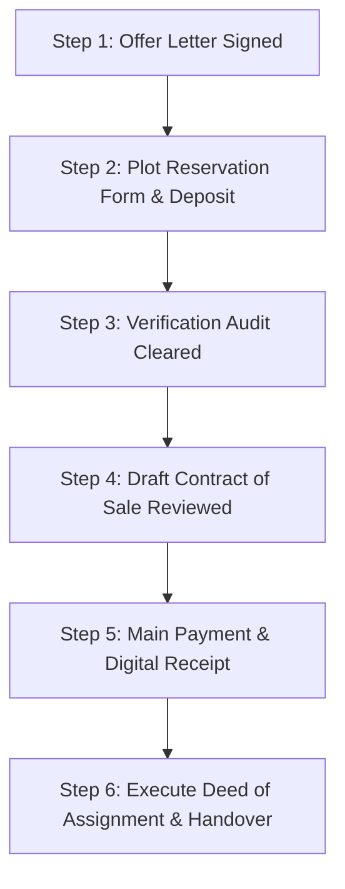

# MODULE 12: Negotiation & Closing

## Handbook 2: Closing, Reservations & Documentation

*"A deal is not closed when the handshake happens. It is closed when the ink dries on the registered deed."*

### Opening Story
A buyer paid ₦40 million directly to a land owner after inspecting a plot of land in Abuja. The owner gave the buyer a hand-written receipt on a piece of paper and promised that his lawyer would "prepare the main Contract of Sale next week." 

Before the contract was drafted, the owner died in a car crash. 

The owner's family claimed they knew nothing about the sale, and since the receipt was informal and did not contain a survey plan or specific plot allocations, the family refused to hand over the land. The transaction was stuck in probate court for four years, during which time the buyer could not access the land or recover his money.

This tragedy was caused by paying money before executing formal transaction documents.

---

### Learning Objectives
By the end of this handbook, you should be able to:
- Guide clients through the formal property closing sequence.
- Secure plot allocations using the reservation form and deposit process.
- Draft and verify standard transaction documents (Contract of Sale, Deeds of Assignment).
- Manage transaction files to ensure compliance and prevent post-sale disputes.

---

### Lesson 1: The Closing Sequence

The closing process is a structured sequence designed to protect the capital of the buyer and the assets of the seller. Never skip a step:

1. **Offer Accepted:** The buyer signs the Offer Letter confirming agreement to the price and payment schedule.
2. **Reservation Form & Deposit:** The buyer fills out the **Plot Reservation Form** and pays a refundable reservation deposit (typically 5% to 10% of the price) to lock the plot numbers.
3. **Verification Cleared:** The legal and coordinates search is completed.
4. **Contract of Sale:** The property lawyer drafts the **Contract of Sale**. Both parties review, sign, and exchange copies.
5. **Main Payment:** The buyer pays the main balance/installment. The seller issues a digital payment receipt.
6. **Execution of Deed of Assignment:** The final transfer documents (Deeds of Assignment, Allocation Letter) are signed by the seller and buyer, transferring ownership rights.

---

### Lesson 2: Securing Plot Reservations

In estate developments, land selling is fast. If a buyer takes two weeks to verify the title, they might return to find the preferred plots have been sold to someone else.

To prevent this, use the **Reservation Form**:
- **Locks the Beacons:** The developer assigns specific plot numbers (e.g., Block A, Plot 5) to the buyer on the layout map.
- **Temporarily Holds the Inventory:** The developer agrees to take the plots off the market for a specified period (typically 7 to 14 days) to allow the buyer to run due diligence.
- **Refundable Terms:** The reservation deposit must be held under clear terms: if the due diligence report reveals a title defect, the deposit is refunded in full.

---

### Lesson 3: Core Transactional Documentation

As an advisor, you must ensure your client's transaction file has these verified documents:

#### 1. The Contract of Sale
This is the preliminary contract showing that the buyer has agreed to purchase and the seller has agreed to sell. It outlines the payment plan, penalties for default, and conditions for physical possession.

#### 2. The Deed of Assignment
This is the ultimate transfer document. It is executed in multiple copies (typically 3 to 5 red copies) and contains:
- The names of the Assignor and Assignee.
- The history of how the seller got the land (Root of Title).
- The detailed survey description of the boundaries.
- The signatures of the Assignor, Assignee, and witnessing lawyers.

#### 3. Allocation Letter
Issued by the developer or family confirming that the physical plot has been measured, beaconed, and handed over to the buyer.

---

### Case Study: The Unregistered Contract

> [!NOTE]
> **Scenario:** Mr. Philip bought a duplex from a private seller in Lagos. They signed a Contract of Sale prepared by a local lawyer. Mr. Philip paid the ₦80 million and moved in. He did not prepare or execute a **Deed of Assignment**, nor did he apply for **Governor's Consent**, believing the signed Contract of Sale was sufficient.
> 
> Five years later, the seller used the property's original C of O (which was still registered in his name at the Land Registry) as collateral to take a ₦50 million loan from a commercial bank. The seller defaulted, and the bank arrived with a court order to take possession of Mr. Philip's house.
> 
> **Outcome:** Mr. Philip had to pay a massive legal bill and negotiate a settlement with the bank because he lacked a registered Deed of Assignment and Governor's Consent, leaving his title unprotected in government records.
> 
> **Lesson:** A Contract of Sale is a promise; a Deed of Assignment is the transfer. Always execute and register the Deed of Assignment immediately after payment.

---

### Chapter Summary
- Handshakes do not transfer property; only legally executed Deeds of Assignment do.
- Reservation forms lock specific plot numbers on layout maps during the due diligence period.
- Payment should never be made until the Contract of Sale has been reviewed and signed by both parties.
- Secure transactions require registration of the Deed of Assignment at the Lands Bureau to prevent double-pledging.

---

### End-of-Chapter Reflection
*Create a transaction checklist for a new client purchasing a land banking plot. Group the tasks under: Pre-Closing, Closing, and Registration.* Record this checklist.
