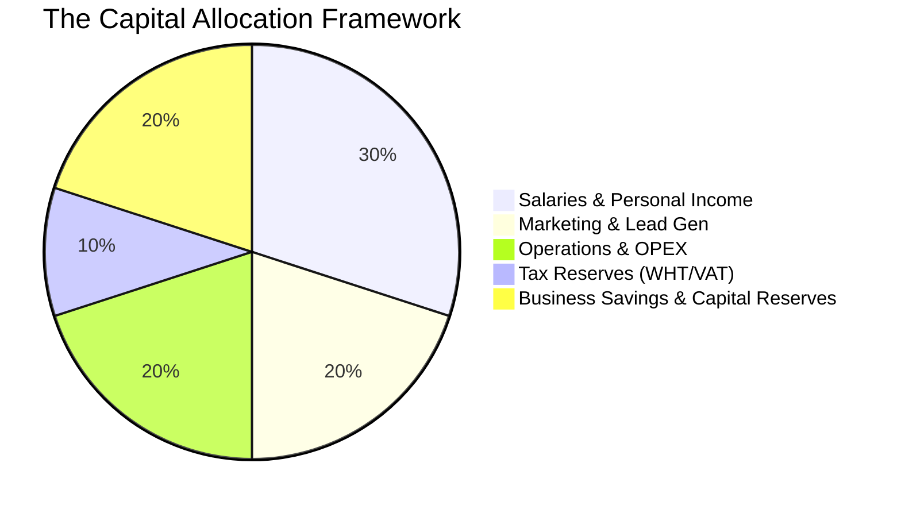

# MODULE 14: Running Your Property Business

## Handbook 1: Financial Structure & Operations

*"Don't treat your commissions as pocket money. Treat them as company revenue."*

### Opening Story
An advisor closed three major sales in a single month, earning ₦6 million in commissions. Excited by his sudden wealth, he immediately upgraded his car, went on an expensive holiday, and bought designer clothes. 

Three months later, the real estate market experienced a quiet period. His phone stopped ringing, and he had no active deals. He did not have money to pay for internet data, his CRM subscription expired, he could not afford fuel for site inspections, and his business name registration fees went unpaid. 

He was temporarily wealthy, but his business went bankrupt because he treated his commissions as personal pocket money.

Another advisor earned the same ₦6 million. He paid himself a fixed salary of ₦500,000. The remaining ₦5.5 million was kept in his corporate bank account, divided systematically into marketing, operations, tax reserves, and business savings. 

His business survived the quiet months and had the capital to launch new ad campaigns when the market recovered.

---

### Learning Objectives
By the end of this handbook, you should be able to:
- Establish a separate corporate legal structure and corporate bank account for your agency.
- Apply the Capital Allocation Framework to divide your commissions.
- Manage your sales pipeline and forecast operational cash flow.
- Understand tax structures and withholding tax (WHT) credit notes in Nigeria.

---

### Lesson 1: Professional Business Setup

To attract HNI clients and corporate developers, you must operate as a registered business, not as an individual agent:

#### 1. Business Name Registration (CAC)
Register your business name (e.g., *Chioma Property Advisors*) with the Corporate Affairs Commission (CAC). This allows you to open a corporate bank account and sign agreements as a corporate entity.

#### 2. Corporate Bank Account
Never let a developer pay commissions into your personal savings account. All business revenues must flow through your corporate account. This:
- Separates business money from personal spending.
- Builds a financial history that makes you eligible for future business loans or asset financing.
- Builds trust with corporate clients who prefer paying into company accounts.

#### 3. Professional Indemnity Insurance
If your budget allows, secure professional indemnity insurance to cover potential legal claims arising from advisory errors.

---

### Lesson 2: The Capital Allocation Framework

When you receive a commission check, do not spend it. You must allocate the funds systematically to ensure business survival and growth:

#### 1. Salaries & Personal Income (30%)
Pay yourself a fixed monthly salary from this portion. Do not touch the rest of the company cash.

#### 2. Marketing & Lead Generation (20%)
Your marketing budget is the fuel of your business. Use this portion to run digital ads, print professional portfolios, and host webinars.

#### 3. Operations & OPEX (20%)
Covers fuel, office space (or co-working spaces), internet data, subscriptions (CRM, design tools), and professional fees (surveyors, lawyers).

#### 4. Tax Reserves (10%)
Keep this aside for local tax liabilities (VAT, corporate income tax).

#### 5. Business Savings & Capital Reserves (20%)
Your emergency fund. Keep this in a yield-generating account (like treasury bills or money market funds) to sustain your operations during market downturns.

---

### Lesson 3: Managing Taxes in Nigerian Real Estate

In Nigeria, commissions are subject to **Withholding Tax (WHT)**:
- Developers typically deduct 5% to 10% from your gross commission as WHT and remit it directly to the Federal Inland Revenue Service (FIRS) or State Internal Revenue Service (LIRS).
- **The WHT Credit Note:** Ensure you collect the WHT Credit Note from the developer after payment. You can use these credit notes to offset your actual personal or corporate income tax liabilities during tax filings.
- **VAT (Value Added Tax):** If you are registered for VAT, you must add 7.5% to your invoices and remit the collected VAT to the FIRS monthly.

---

### Case Study: The Saved Budget

> [!NOTE]
> **Scenario:** Advisor Wale closed a deal and received a commission of ₦3 million. Under the Capital Allocation Framework, he kept ₦600,000 (20%) in a dedicated "Business Savings" account and ₦600,000 (20%) in "Marketing."
> 
> Six months later, a fuel crisis hit Nigeria, doubling transport costs, and sales slowed down. Many agents could not afford to drive clients for inspections and went out of business.
> 
> **Wale's Action:** Wale used his Business Savings reserve to cover his increased fuel costs and launched a targeted ad campaign using his Marketing reserve.
> 
> **Outcome:** While competitors were inactive, Wale continued showing properties and closed two transactions during the crisis.
> 
> **Lesson:** Capital reserves are your shock absorbers during economic crises.

---

### Chapter Summary
- Operating a property business requires formal CAC registration and separate corporate bank accounts.
- Commissions must be divided systematically: Salaries (30%), Marketing (20%), OPEX (20%), Tax (10%), and Savings (20%).
- Withholding Tax (WHT) credit notes must be collected from developers to reduce your annual tax liability.
- Financial discipline is the ultimate differentiator between short-term agents and long-term advisors.

---

### End-of-Chapter Reflection
*Calculate the capital allocation distribution for a commission check of ₦5 million. Write down the exact amounts you will allocate to: Salary, Marketing, OPEX, Tax, and Savings.* Record these numbers.
