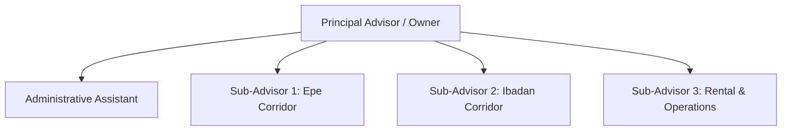

# MODULE 14: Running Your Property Business

## Handbook 3: Scaling, Hiring & Leadership

*"You can go fast alone, but you can go far only with a team."*

### Opening Story
An advisor built a highly successful personal brand. She was closing three deals a month and earning ₦4 million in monthly commissions. However, she was working 16 hours a day. She was answering client calls, managing digital ads, running coordinates searches at registries, driving to Epe for inspections, preparing contracts, and handling tenant repairs. 

She was exhausted, had no personal life, and began making mistakes (missing client appointments, losing files). Her business hit a ceiling; she could not close more deals because she had no more hours in the day.

She hired her first employee: an administrative assistant. She trained him to handle listing uploads, log CRM entries, and coordinate with surveyors. 

This freed up 40% of her time. She focused the extra hours on HNI networking and corporate partnerships. 

Within six months, her sales tripled to nine deals a month. She transitioned from an exhausted broker to a business owner.

---

### Learning Objectives
By the end of this handbook, you should be able to:
- Identify when your property business is ready to scale and hire.
- Design a structured recruitment and training pipeline for sub-advisors.
- Establish commission split models and team structures.
- Implement leadership and quality control workflows to protect your brand.

---

### Lesson 1: The Scaling Threshold

Do not hire employees too early. If you have no consistent sales, hiring adds overhead cost that will sink your business. Look for these **Scaling Triggers**:

- **Time Constraints:** You are spending more than 50% of your day on admin tasks (documentation, registry searches, uploads) instead of client consulting.
- **Lost Opportunities:** You are turning down inspections or missing client follow-ups because you are busy with other deals.
- **Capital Reserve:** You have at least six months of operational overhead (salaries, marketing, subscriptions) saved in your Business Savings account.

#### The First Hire:
Your first hire should be a **Virtual Assistant or Administrative Assistant** to take over paperwork, schedule coordination, and basic CRM management. This frees up your time for high-value sales.

---

### Lesson 2: Building Your Advisory Team

Once your administrative structure is stable, you can scale your sales volume by hiring **Sub-Advisors (Junior Advisors)**.

#### The Team Structure:

- **Principal Advisor (You):** Focuses on B2B deals, JV structuring, HNI networking, and brand leadership.
- **Sub-Advisors:** Handle inbound leads, coordinate site inspections, and follow up on retail sales within specific growth corridors.
- **Admin Support:** Manages the CRM, documentation, and coordination with surveyors/lawyers.

---

### Lesson 3: Commission Splits & Incentives

Sub-advisors are typically compensated using a commission-split model. This keeps your overhead low while incentivizing performance:

#### Standard Split Models:
1. **Self-Sourced Leads (70/30 or 80/20):** If the sub-advisor generates the lead independently and closes the sale using your company inventory and office support, they retain 70% to 80% of the commission, and the company takes 20% to 30%.
2. **Company-Provided Leads (50/50):** If the company generates the lead through advertising and hands it to the sub-advisor to inspect and close, the commission is split equally: 50% to the sub-advisor, 50% to the company.
3. **Admin/Team Overrides (5% - 10%):** The team leader or principal advisor takes a small percentage override from all team sales to cover management and training costs.

---

### Lesson 4: Brand Integrity & Quality Control

The biggest risk of scaling a team is **brand dilution**. If a sub-advisor lies to a client, hides defects, or fails to verify coordinates, your hard-earned business reputation is destroyed.

#### Quality Control Workflows:
- **Mandatory Onboarding & Certification:** Every sub-advisor hired must go through the Housmata Academy and pass the certification exam.
- **The Dual Sign-Off Rule:** Before any Due Diligence Report or Offer Letter is sent to a client under your company name, the Principal Advisor must review and sign off.
- **Regular Audits:** Run weekly audits of CRM logs to ensure sub-advisors are maintaining professional communication standards.

---

### Case Study: The Scaled Agency

> [!NOTE]
> **Scenario:** Advisor Chioma ran a successful boutique agency. She hired three junior advisors and put them through the Housmata Certification course. She established a 50/50 split on company leads and set up a weekly team pipeline audit.
> 
> **The Leverage:** Instead of running 15 site inspections herself every Saturday, Chioma focused on securing exclusive listing agreements with top developers in Epe. She handed the buyers' leads to her junior advisors, who conducted the inspections.
> 
> **Outcome:** In one month, her team closed ten sales. Chioma earned ₦15 million in commissions, and her junior advisors earned ₦10 million collectively.
> 
> **Lesson:** True scale is achieved when your business operates through other people's time and effort, guided by your systems and brand.

---

### Chapter Summary
- Scaling requires transitioning from an individual broker to a system-driven business owner.
- The first hire should manage administrative support to free up the owner's sales capacity.
- Advisory teams operate on commission-split models based on lead sources.
- Protecting brand integrity requires mandatory advisor training, registry audits, and dual sign-off rules.

---

### End-of-Chapter Reflection
*Draft a job description for a Junior Property Advisor role for your agency. Outline the required skills, responsibilities (including coordinates checks), and the commission-split compensation structure.* Record this in your journal.
