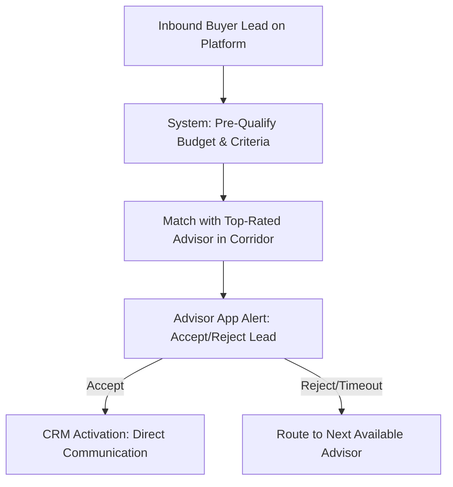

# MODULE 15: Becoming a Housmata Certified Property Advisor

## Handbook 2: Professional Activation & Ecosystem Benefits

*"The certification is your qualification; activation is your engine of growth."*

### Opening Story
After passing her assessments, Advisor Teni received her official HCPA digital credentials. Within 24 hours, her profile was activated on the Housmata public registry. 

She received her **Professional ID Card** and the **HCPA Digital Badge**, which she embedded in her email signature and social media pages.

A week later, an investor from London visited the Housmata platform. He was looking for a verified advisor in Epe. He searched the public registry, found Teni's profile showing her verified credentials and local specialization, and clicked *"Connect with Teni."*

The system routed the lead directly to Teni's Housmata App. Within a month, she closed a transaction worth ₦40 million. 

She did not hunt for the lead; the platform's trust ecosystem delivered the lead to her.

---

### Learning Objectives
By the end of this handbook, you should be able to:
- Complete your profile activation on the Housmata Platform.
- Use your professional credentials (ID Card, Digital Badge) to build credibility.
- Navigate the Housmata Lead Access workflow to receive pre-qualified buyer leads.
- Understand the commission split models and agency partnership agreements.

---

### Lesson 1: Platform Activation & Profile Setup

Once your certification is signed off by the board, your advisor profile is ready for public activation. Do not leave your profile blank; it is your digital office:

#### Profile Optimization Steps:
1. **Verification Status:** Upload your CAC corporate registration and Tax ID to verify your business status on the platform. This proves to corporate clients that you are a registered entity.
2. **Geographic Tagging:** Select your target growth corridors (e.g., Epe, Ibadan Circular Road, Lekki). This allows the system to route matching leads to you.
3. **Bio and UVP:** Add your professional headshot, your Unique Value Proposition (UVP) statement, and links to your published market reports.
4. **Client Reviews Integration:** Set up your review link. Ask past clients to log their testimonials directly on your profile. The system prioritizes profiles with high positive reviews.

---

### Lesson 2: Credentials and Professional ID

As a certified advisor, you receive the **HCPA Credential Kit**. Use these tools to build immediate trust with new clients:

- **Professional ID Card:** A physical card containing your photo, certification level, registration number, and a QR code. When scanned by a client, the QR code redirects to your active, verified profile on the official Housmata registry. This prevents impersonation and proves your certification is active.
- **The Digital Badge:** A secure, cryptographically verified badge (hosted via Credly or a similar system) to showcase on your website, email footer, and LinkedIn profile.
- **Listing Privileges:** Authorization to register and publish verified properties on the Housmata inventory. Only certified advisors can publish on the platform.

---

### Lesson 3: The Lead Access Workflow

Housmata does not compete with its advisors. The platform generates inbound buyer leads through national and international marketing, and routes them to advisors using a structured model:

#### The Lead Acceptance Rules:
- **Response Speed (The 15-Minute Rule):** You must accept a routed lead within 15 minutes of the app notification. If you miss the window, the lead is automatically routed to the next top-rated advisor in that corridor.
- **Lead Quality:** All routed leads are pre-qualified by the system (verifying their budget capacity and timeline) before allocation.
- **Performance-Based Routing:** Advisors who maintain high customer ratings, detailed CRM logs, and high transaction closing speeds receive priority routing for premium HNI leads.

---

### Lesson 4: Commission Structures & splits

As an independent partner operating inside the Housmata ecosystem:

- **Retail Sales Commission:** Standard developers pay 5% to 15% commission on closed sales. When you close a sale using a lead sourced from the Housmata platform, a standard platform fee (split) is deducted (e.g., 20% platform share, 80% advisor share).
- **Self-Sourced Sales:** If you close a client you sourced independently using the Housmata app tools and inventory, you retain 100% of the developer's commission.
- **Team Splits:** If you scale your business and build an agency team, you can configure custom splits for your sub-advisors directly within the manager portal.

---

### Chapter Summary
- Profile activation on the public registry makes you visible to high-value buyers.
- Your ID Card's QR code provides instant proof of your active certification status on-site.
- The platform routes pre-qualified buyer leads to advisors based on corridor specialty and performance ratings.
- Transparent commission splits reward both independent client acquisition and platform-sourced lead closing.

---

### End-of-Chapter Reflection
*Scan your mock profile QR code or review your digital badge layout. How will you introduce these credentials to a client during your first physical meeting to establish your professional standing?* Write down your introductory pitch.
