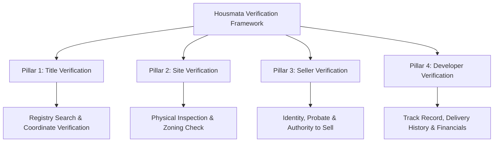

# MODULE 5: Property Verification & Due Diligence

## Handbook 1: The Housmata Verification Framework

*"Trust begins with verification. If you haven't verified it, you shouldn't market it."*

### Opening Story
A middle-class couple living in London saved £30,000 to buy their first home in Lagos. They contacted a popular Instagram agent who showed them video clips of a beautiful estate in Lekki. The agent assured them the estate had "Global C of O in view" and that development was moving fast.

Eager to secure the property, they paid the full amount.

Three years later, they flew to Nigeria to inspect their home, only to find a waterlogged swamp. The developer had abandoned the project after local authorities halted construction. A search at the land registry revealed the land was actually under a committed government acquisition zone for a regional coastal road. The "Global C of O" did not exist.

The couple lost their life savings. The agent stopped answering their calls. 

This is the tragedy of unverified transactions. At Housmata, we believe that every real estate transaction must be built on absolute clarity. Verification is not just a chore; it is our signature promise to the market.

---

### Learning Objectives
By the end of this handbook, you should be able to:
- Explain why verification is the core pillar of the Housmata philosophy.
- Apply the Housmata 4-Pillars of Verification Framework to any property.
- Understand the role of the Property Advisor as a risk gatekeeper.
- Distinguish between "claims" and "verified facts" in property marketing.

---

### Lesson 1: Verification is Our Signature Expertise

In the Nigerian real estate market, trust is low because fraud, double-selling, and government demolition of illegal structures are common. Most agents focus solely on closing the sale to earn a commission, leaving the buyer to bear 100% of the risk.

Housmata is different. A Housmata Certified Property Advisor operates under a strict rule: **We do not sell what we have not verified.**

#### The Economic Necessity of Diligence:
Real estate is a high-ticket transaction, often involving a buyer's life savings. Unlike minor consumer purchases where a defective product can be returned, real estate mistakes are permanent, expensive, and legally draining. When an advisor fails to verify a property, they are not just making a marketing error; they are exposing their client to financial ruin. 

Verification is our signature expertise because it solves the market's biggest pain point: **Fear of loss.** By positioning yourself as a rigorous verifier rather than a standard salesperson, you build a sustainable advisory brand.

---

### Lesson 2: The 4-Pillars of Verification Framework

To verify a property thoroughly, you must analyze it through the **Housmata 4-Pillars of Verification Framework**. If any of these pillars fail, the transaction should be flagged.

#### Pillar 1: Title Verification (The Legal Right)
You must confirm that the property has a clean, registered legal title. This requires obtaining a copy of the land documents (e.g., Certificate of Occupancy, registered Deed of Assignment, Gazette) and running a search at the Lands Bureau. You must verify that the document is genuine, matches the registry records, and is free from mortgages, court injunctions, or government acquisitions.

#### Pillar 2: Site Verification (The Physical Reality)
Never assume the land is where the papers say it is. You must physically visit the site, pick the GPS coordinates using a handheld device directly from the boundary beacons, and check the location against the master plan layout. You must analyze the topography (whether it is dry or swampy), access roads, and proximity to pipelines, power lines, or erosion channels.

#### Pillar 3: Seller Verification (The Authorized Owner)
You must verify that the person offering the land is the actual legal owner or has the legal capacity to sell it. If the property belongs to a family, you must confirm that the Family Head and principal members have signed off. If the owner is deceased, you must verify the Letters of Administration or Probate.

#### Pillar 4: Developer Verification (The Execution Power)
If the property is an off-plan development, you must audit the developer's track record. Have they delivered projects before? What is their financial health? Are they funding the project with equity, bank loans, or strictly from buyers' pre-construction deposits?

---

### Lesson 3: Claims vs. Verified Facts

In property advertisements, you will encounter many marketing terms designed to sound prestigious. As a professional advisor, you must decode these claims:

#### 1. "C of O in View"
- **The Claim:** The developer has applied for a Certificate of Occupancy, and it will be issued soon.
- **The Reality:** **There is no C of O.** The application might be stuck in process, rejected, or might not have been submitted at all. Until the Governor signs the document and it receives a registration number, the land has no legal title. You must price and treat the land as un-titled.

#### 2. "Free from Government Acquisition"
- **The Claim:** The land is not under government reserve.
- **The Reality:** This can only be verified by a coordinate search. Many developers sell plots in forest reserves or agricultural zones, claiming they are free. You must pick the coordinates on-site and run a status check.

#### 3. "100% Dry Land"
- **The Claim:** The land is dry and ready for immediate construction.
- **The Reality:** Swampy land can be sandfilled during the dry season to look dry. As soon as the rainy season starts, the water table rises, flooding the foundations. You must check the vegetation (e.g., bamboo or marsh grass) and soil composition.

---

### Case Study: The "C of O in View" Trap

> [!NOTE]
> **Scenario:** A developer advertised plots in a new estate in Ibeju-Lekki for ₦8 million per plot, claiming "C of O in view."
> 
> A buyer contacted a Housmata Advisor to inspect the estate. The advisor requested the estate's survey plan and layout scheme. The developer refused, stating that "it was confidential until a deposit was paid."
> 
> **Action:** The advisor used a handheld GPS device to pick coordinates from the boundary pillars of the site and ran a coordinate search. The search report revealed the land fell inside a committed agricultural zone designated for government food security projects, where private residential development is strictly prohibited.
> 
> **Outcome:** The buyer did not invest. Six months later, the state government demolished the developer's gatehouse and issued a warning to the public to avoid the site.
> 
> **Lesson:** If a seller hides survey documents or rushes you to pay before due diligence, it is an immediate red flag.

---

### Chapter Summary
- Property verification is the cornerstone of the Housmata brand.
- The 4-Pillars of Verification are: Title, Site, Seller, and Developer.
- Never rely on verbal claims; verify every document at the appropriate government registry.
- A professional advisor steps away from any transaction where information is hidden.

---

### End-of-Chapter Reflection
*How would you handle a situation where a developer offers you a 20% commission on a property, but refuses to allow you to take GPS coordinates of the site before your client pays?* Write your ethical decision and reasoning in your journal.
