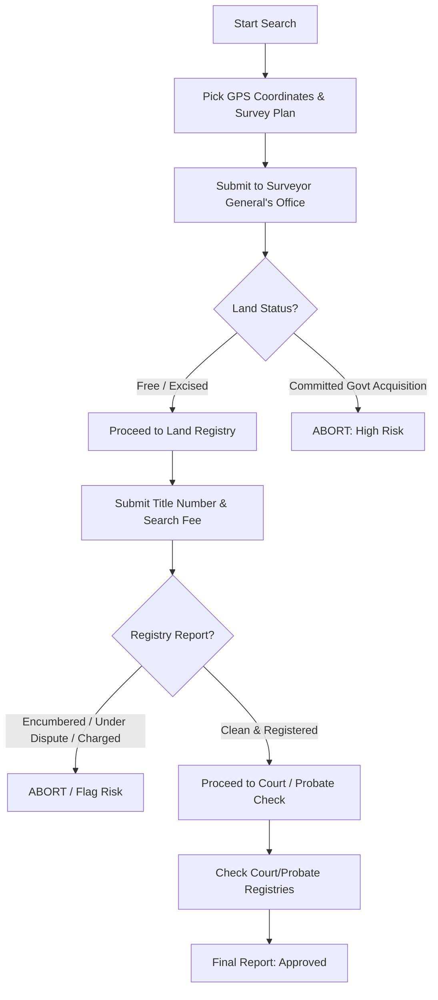

# MODULE 5: Property Verification & Due Diligence

## Handbook 2: Document & Title Verification

*"A property is only as good as the paper it is written on."*

### Opening Story
In 2018, Chief Williams bought a commercial building in Ikeja, Lagos, for ₦120 million. The seller presented a registered Certificate of Occupancy (C of O) bearing his name, along with a signed Deed of Assignment. Everything looked perfect. Chief Williams paid the money and registered the transfer.

Two years later, Chief Williams was served a court summons. It turned out the seller had divorced his wife three years prior, and the court had awarded 50% ownership of the property to the ex-wife, prohibiting any sale without her consent. The seller had forged his ex-wife's signature on the transfer documents and fled the country.

The court ruled the sale invalid. Chief Williams lost the property and his money.

This tragedy could have been prevented by a simple search at the High Court Registry and a verification of the signatures.

---

### Learning Objectives
By the end of this handbook, you should be able to:
- Identify and explain the common property title documents in Nigeria.
- Understand the process of running searches at the Land Registry, Surveyor General's office, and Probate Registry.
- Collaborate effectively with surveyors and property lawyers during due diligence.
- Verify the authenticity of signatures and powers of attorney.

---

### Lesson 1: Deconstructing Property Titles

Understanding titles is the core legal skill of a Property Advisor. You must know what each document represents and what questions it answers:

#### 1. Survey Plan (The Identity Document)
- **What it is:** A document showing the physical boundaries, measurements, and coordinates of a piece of land. It is prepared by a licensed surveyor.
- **Key Check:** Ensure the survey is registered and has a clear red copy (lodged at the Surveyor General's office). A survey plan shows *where* the land is, but it does **not** prove ownership by itself.

#### 2. Excision & Gazette (The Release Documents)
- **What it is:** Historically, the government acquired large areas of land. **Excision** is the legal process by which the government releases a portion of land to indigenous families or communities. The **Gazette** is the official government publication that records the details of this excision.
- **Key Check:** Verify the Gazette volume, page, and date. Land with an excision in progress has no legal title yet; only land with a completed, gazetted excision is legally tradeable.

#### 3. Certificate of Occupancy (C of O) (The Primary Grant)
- **What it is:** Under the Land Use Act of 1978, all land is owned by the state. The Certificate of Occupancy is the official document issued by the Governor granting a person or corporate entity a 99-year lease on the land.
- **Key Check:** Verify the C of O number at the Lands Registry to confirm it is genuine and free from bank charges or mortgages.

#### 4. Governor's Consent (The Transfer Approval)
- **What it is:** Once a C of O has been issued, any subsequent sale or transfer of interest in that property requires the official consent of the State Governor.
- **Key Check:** A Deed of Assignment signed without Governor's Consent is legally incomplete and cannot be registered as title.

#### 5. Deed of Assignment (The Transfer Contract)
- **What it is:** The legal document transferring ownership rights from the seller (Assignor) to the buyer (Assignee). It shows the Root of Title—the chain of previous owners.

---

### Lesson 2: The Three-Step Search Process

To verify a title, you must run official searches at the relevant government registries. Do not rely on paper photocopies presented by the seller:

#### Step 1: The Coordinate Search (Surveyor General's Office)
This check confirms that the land is physically situated in a free development zone. Submit the coordinates of the boundary pillars to verify that the land does not fall within committed government zones (e.g., road setbacks, forest reserves, agricultural acquisitions).

#### Step 2: The Land Registry Search (Lands Bureau)
Submit the title document number (e.g., C of O or Registered Deed number) to:
- Verify that the document matches the official registry records.
- Confirm the name on the title matches the seller.
- Check for **encumbrances** (e.g., has the owner used the land as collateral for a bank loan? Is there a court injunction against the property?).

#### Step 3: The Probate & Court Search
If the property belonged to a deceased person, you must verify that the sellers have a **Grant of Probate** or **Letters of Administration** from the High Court Probate Registry. Additionally, run a search at the local High Court registry to confirm the property is not subject to active litigation or family disputes.

---

### Lesson 3: Working with Surveyors and Lawyers

A Property Advisor is not a lawyer or a surveyor. **You must never act as one.** Your job is to coordinate the due diligence process.

- **The Licensed Surveyor:** Responsible for picking coordinates on-site, verifying boundaries on the ground, and running searches at the Surveyor General's office.
- **The Property Lawyer:** Responsible for running searches at the Lands Registry, drafting the Deed of Assignment, reviewing joint venture agreements, and ensuring legal compliance.

Always advise your clients: *"I will coordinate the verification process, but we must retain a licensed surveyor and a qualified property lawyer to verify the coordinates and sign off on the legal title."*

---

### Case Study: The Forged Power of Attorney

> [!NOTE]
> **Scenario:** Mr. David, a resident of London, owned a plot of land in Lekki. An agent in Lagos found a buyer willing to pay ₦60 million. The agent presented a "Power of Attorney" signed by Mr. David, authorizing the agent to sell the property on his behalf.
> 
> The buyer's Housmata Advisor insisted on verifying the Power of Attorney. 
> 
> **Verification Action:** The advisor contacted Mr. David directly via email (obtained from public records, not from the agent) and scheduled a video call to verify his identity.
> 
> **Outcome:** Mr. David was shocked. He had never signed a Power of Attorney and had no intention of selling his land. The agent had forged the document. The transaction was aborted, and the police were notified.
> 
> **Lesson:** Never accept a Power of Attorney without direct, independent verification from the owner of the title.

---

### Chapter Summary
- There are multiple property titles in Nigeria; each carries a different level of legal security.
- Verification requires searches at three levels: Surveyor General (coordinates), Lands Registry (ownership & encumbrances), and Court/Probate (disputes & capacity).
- Always work with licensed professionals (lawyers and surveyors) to secure transactions.

---

### End-of-Chapter Reflection
*If a client pressures you to skip a Land Registry search because the seller is a well-known community leader, how would you explain the necessity of the search without offending the client or the seller?* Write down your talking points.
