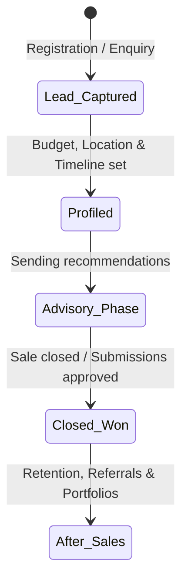

# MODULE 7: Digital Real Estate & The Housmata Platform

## Handbook 1: Operating the Housmata App & CRM

*"Systems run the business, and people run the systems."*

### Opening Story
Consider two Property Advisors working in the same city. 

*Advisor A* runs his business on paper notebooks, scattered WhatsApp messages, and a calendar in his head. When a client calls to ask about a property they discussed three months ago, Advisor A has to scroll through hundreds of chat threads, search for paper notes, and often calls the client back hours later—sometimes giving wrong details. He is constantly overwhelmed, misses follow-ups, and struggles to close more than one deal a month.

*Advisor B* uses the Housmata App and CRM. When a new client registers, the system automatically profiles them, maps their requirements, and suggests verified listings. Advisor B records notes from every call, sets automated reminders for follow-ups, and sends professional property portfolios with a single click. 

Advisor B can easily manage fifty active clients simultaneously without feeling stressed. He closes four deals a month because his systems never forget.

---

### Learning Objectives
By the end of this handbook, you should be able to:
- Navigate the Housmata platform and advisor dashboard.
- Utilise the built-in CRM system to manage clients, interactions, and follow-ups.
- Standardise communication logs for transparency and audit readiness.
- Apply digital productivity tools to scale your advisory business.

---

### Lesson 1: Deconstructing the Housmata App Dashboard

The **Housmata App** is a digital workspace designed specifically for Certified Property Advisors. It is not a listing portal; it is an integrated operating system that combines property inventories, verification data, client relationships, and legal documentation.

#### Core Modules of the Housmata Platform:
1. **Advisor Dashboard:** Your central command center showing active leads, pending verifications, tasks, and monthly sales performance analytics. It aggregates your sales KPIs so you can see where your business stands in real-time.
2. **Verified Inventory:** A central database of properties that have passed the Housmata 4-Pillars of Verification. It contains survey plans, coordinates checks, and land status reports for each listing.
3. **Client Relationship Management (CRM):** A database of your clients' contact information, preferences, budgets, interaction history, and document storage.
4. **Digital Contracts Engine:** Tool for generating tenancy agreements, receipts, and offer letters.

---

### Lesson 2: Mastering the CRM Lifecycle

A CRM (Client Relationship Management) system is only useful if it contains clean, consistent data. The Housmata CRM operates on a simple lifecycle:

#### 1. Lead Capture & Profiling
Every time a client makes an enquiry, log them immediately. Profile their:
- **Financial Status:** Budget limit, financing route (cash vs. mortgage).
- **Motivation:** Long-term investment (land banking), immediate development, or home purchase.
- **Timeline:** When do they plan to close? (Immediate vs. 6-12 months).

#### 2. Communication Logging
After every phone call, physical meeting, or site inspection, you must write a **Communication Log** in the CRM.
- *Poor Log:* "Spoke with client. He was happy."
- *Professional Log:* "Called Mr. Kunle to review the Epe Due Diligence report. He expressed concern over the high-tension power line setback. Recommended erecting a boundary wall. Next action: Schedule video call with developer on Tuesday, 10 AM, to discuss custom boundary construction."

---

### Lesson 3: Personal Productivity & Lead Management

To handle high volumes of clients without dropping the ball, you must leverage automation within the CRM:

- **Automated Follow-ups:** Set reminders to check in on clients who are "thinking it over" after 3 days, 1 week, and 3 weeks.
- **Smart Filters:** Group your database by interest areas (e.g., "Epe Land Bankers," "Mortgage Seekers," "Abuja Commercial Investors") to send targeted property updates.
- **Quick Share Portfolios:** Instead of sending dozens of individual photos on WhatsApp, generate a single premium digital brochure link from the Housmata platform showing all verified specifications.

---

### Case Study: The CRM Recall

> [!NOTE]
> **Scenario:** Mr. Adeleke enquired about a commercial plot in 2024. He mentioned in passing that his daughter would be starting university in 2026, and he hoped to invest in a student hostel project near the campus around that time. 
> 
> The Housmata Advisor recorded this detail in the CRM and set a task reminder for May 2026 titled: *"Contact Mr. Adeleke regarding student hostel investment."*
> 
> **Outcome:** In May 2026, the CRM sent a notification to the Advisor. The Advisor called Mr. Adeleke: *"Good morning, sir. I recall you mentioned two years ago that your daughter would be entering university this year, and you wanted to set up a student housing portfolio. We just verified a new student residential layout 2 minutes from the campus entrance. Would you like to review the layout?"*
> 
> Mr. Adeleke was blown away by the Advisor's memory. He closed the deal within a week.
> 
> **Lesson:** The human brain is for creating ideas, not holding data. Trust your CRM to remember the details.

---

### Chapter Summary
- The Housmata App combines inventory, CRM, and digital documentation into a single system.
- Clean CRM entry and active communication logging are mandatory requirements for all advisors.
- Automating follow-ups and group filters allows advisors to manage large client databases efficiently.

---

### End-of-Chapter Reflection
*Open your Housmata Advisor app. Input a mock client profile for a diaspora investor looking for a ₦15 million land banking plot. Log a simulated communication entry detailing their questions about title excision.* Save this entry as part of your onboarding practice.
