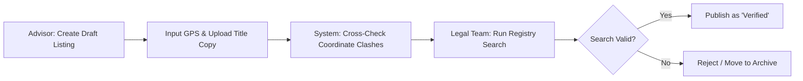

# MODULE 7: Digital Real Estate & The Housmata Platform

## Handbook 2: Digital Verification & Listing Workflows

*"Data integrity is the foundation of platform credibility."*

### Opening Story
A buyer visited a popular property portal in Nigeria to find a 4-bedroom terrace house in Lekki. He saw the same house listed by fifteen different agents. Each listing had different photos, varying prices (ranging from ₦65 million to ₦85 million), and conflicting descriptions of the title (one said "Global C of O", another said "Consent", another said "Deed of Assignment").

Confused and suspicious, the buyer closed the tab. He did not contact any of the agents because the platform felt like a chaotic marketplace full of duplicates and noise.

Later, he visited the Housmata platform. He found a single, clean, verified listing for the house. The price was fixed, the photos were professional and watermarked, and the title status was verified by the Housmata legal audit.

He immediately booked an inspection. 

---

### Learning Objectives
By the end of this handbook, you should be able to:
- Create and upload verified listings using the Housmata digital template.
- Identify and prevent duplicate, fake, or inconsistent property data on the platform.
- Execute digital verification workflows to submit properties for legal sign-off.
- Understand the role of AI and data analytics in predicting property recommendations.

---

### Lesson 1: Standardizing Listing Formats

In traditional listing sites, listing data is chaotic. To maintain platform trust, Housmata enforces **Listing Standardization**. Every property listing must contain verified, clean data:

#### Required Fields for a Housmata Listing:
1. **The Unique Identifier (Property ID):** Generated automatically by the system to prevent duplication.
2. **Verified Price:** The actual purchase price, including mandatory development levies. Hidden fees are strictly prohibited.
3. **GPS Boundary Coordinates:** Easting and Northing values picked on-site to lock the location.
4. **Original Media:** High-resolution, unedited photos and video walk-throughs captured by the advisor or verification team. Stock renders must be labeled as "3D Concept Renders."
5. **Verified Title Status:** An uploaded scan of the title document accompanied by the Lands Registry search report number.

---

### Lesson 2: Preventing Platform Noise & Duplication

Traditional listing platforms suffer from "Agent Spam," where multiple agents list the same property to compete for leads. Housmata eliminates this through **Digital Listing Ownership**:

- **One Property, One Listing:** The first Advisor who completes the physical coordinates verification and registers the property owns the digital listing on the platform.
- **Coordinate Locking:** If an advisor attempts to upload a property with GPS coordinates that overlap with an existing listing, the system blocks the upload as a duplicate.
- **Mandatory Exclusivity/Verification Checks:** Properties that fail the legal audit are removed from the public inventory and placed in a "Failed Verification" archive.

---

### Lesson 3: The Digital Verification Workflow

When you discover a new property to market, you must run it through the app's **Digital Verification Workflow**:

1. **Upload Phase:** The advisor uploads the draft listing, including the survey plan and GPS coordinates.
2. **System Check:** The system automatically checks for coordinate clashes and verifies the location on regional zoning maps.
3. **Legal Audit:** The Housmata legal team receives the package digitally, runs the registry search, and logs the search result ID on the platform.
4. **Publishing:** Once approved, the listing receives the green **"Housmata Verified"** badge and goes live.

---

### Lesson 4: AI & Predictive Recommendations (Roadmap)

As the database grows, the Housmata platform utilizes predictive analytics:
- **Client Matching Engine:** The system analyzes a client's budget, search history, and profile to recommend properties with the highest likelihood of approval or investment match.
- **Future Growth Estimation:** The platform logs historical appreciation rates across growth corridors to estimate future ROI, helping advisors present data-backed reports.

---

### Case Study: The Coordinate Shield in Action

> [!NOTE]
> **Scenario:** Advisor John found a newly built block of apartments in Yaba and wanted to list them. When he stood on the site and picked the GPS coordinates using the Housmata app, the system issued an alert:
> 
> *“Warning: This coordinate set matches an active listing: 'Yaba Plaza Towers' registered by Advisor Sandra.”*
> 
> **Resolution:** John realized the developer had already given Sandra exclusive digital listing rights on the Housmata platform. Instead of creating a duplicate listing, John contacted Sandra through the app to coordinate a joint-marketing split on the buyer side.
> 
> **Outcome:** The platform remained clean, and Sandra and John closed a sale together, split the commission, and maintained professional integrity.

---

### Chapter Summary
- Data integrity and standardized listing structures are vital to building buyer confidence.
- Coordinate locking prevents duplicate, fake, or spam listings on the Housmata platform.
- The digital verification workflow ensures every listing is legally cleared before marketing.
- Joint-marketing partnerships within the app turn competition into collaboration.

---

### End-of-Chapter Reflection
*If you notice that a competitor platform has listed a property in your area at a lower price than what is registered on the Housmata app, what steps would you take to verify the actual price and protect your client?* Write down your plan in your journal.
