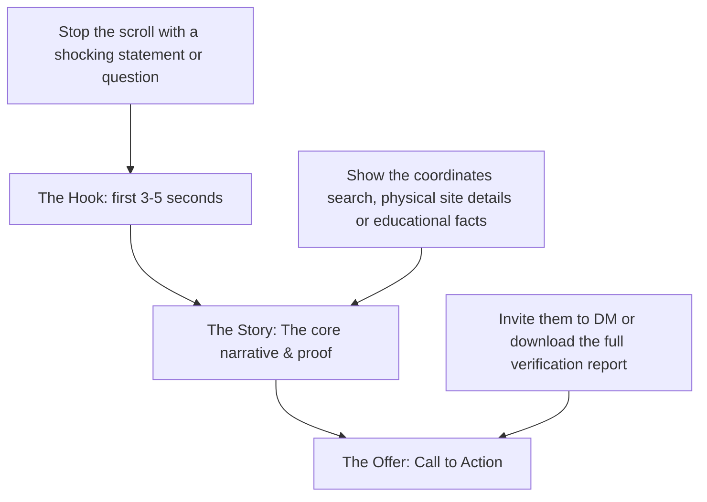

# MODULE 8: Marketing, Personal Branding & Business Growth

## Handbook 3: Video Marketing & Content Production

*"A photo shows a property. A video tells its story."*

### Opening Story
An advisor listed a beautiful, newly built 4-bedroom duplex in Lekki. He took twenty high-quality photos showing the marble floors, the modern kitchen, and the spacious bedrooms. He uploaded them to a property website and waited. Over a month, he received only two calls, and both buyers backed out after visiting the site.

Another advisor listed the same property. Instead of photos, he took his smartphone, attached a clip-on wireless microphone, and shot a 90-second walkthrough video. 

He started the video standing on the balcony: *"Imagine waking up to this quiet morning view every day. Many duplexes in Lekki have beautiful finishes, but this is one of the few that has a fully integrated drainage system built by the developer to prevent seasonal flooding."* 

He then walked through the house, pointing out the practical design features, such as the natural lighting in the kitchen and the double-layered security doors.

The video was posted on Instagram and YouTube. Within 48 hours, the video had received 10,000 views. He closed the sale with a buyer who bought the house off-plan from London, purely based on the trust built through the video tour.

---

### Learning Objectives
By the end of this handbook, you should be able to:
- Explain why video marketing is highly effective in property sales.
- Produce professional property walkthroughs using a smartphone.
- Structure video scripts using the **Hook-Story-Offer** framework.
- Master basic audio and lighting standards for mobile content creation.

---

### Lesson 1: Why Video Marketing is Essential

Real estate is a high-cost purchase. Buyers—especially diaspora investors—are afraid of being scammed by fake photos. Video is the ultimate tool to build trust online:

- **Unedited Reality:** Video shows the actual layout, spatial flow, and context of the neighborhood. It is much harder to fake than a single photo.
- **Showcases Your Professionalism:** When you stand in front of the camera and explain building features or due diligence checks, the viewer sees you as an active, competent guide.
- **Higher Platform Reach:** Social media algorithms (Instagram Reels, TikTok, YouTube Shorts, LinkedIn Video) prioritize video content over text and image posts.

---

### Lesson 2: The Three Types of Real Estate Videos

To build a balanced brand, you must produce three categories of video content:

#### 1. The Educational Explainer
- **Goal:** Build authority.
- **Concept:** Stand in front of the camera or a whiteboard and explain a real estate concept (e.g., *"How to check if your land has a Governor's Consent"* or *"3 things to look for during a rainy season inspection"*).

#### 2. The Technical Walkthrough
- **Goal:** Showcase inventory and due diligence.
- **Concept:** Walk through a property or land site. Do not just show the aesthetics; show the technical aspects (drainage systems, coordinate checks, road access, setback boundaries).

#### 3. The Client Testimonial
- **Goal:** Social proof.
- **Concept:** Record a short interview with a happy client after closing. Let them describe their initial fears and how you helped them verify and secure their investment.

---

### Lesson 3: Structuring Your Video Script

Do not turn on the camera and start talking without a plan. You must structure every marketing video using the **Hook-Story-Offer** framework:

#### 1. The Hook (0 - 5 seconds)
Stop the user from scrolling. Start with a shocking statement, a question, or a major benefit.
- *Amateur Hook:* "Hello, I am John, and today I want to show you this house."
- *Authority Hook:* *"Do not pay for any land in Epe until you check this one critical detail."*

#### 2. The Story / Proof (5 - 45 seconds)
Deliver on the hook's promise. Show the evidence, explain the details, and walk the viewer through the property. Show coordinates checks, physical drainage, or title documents.

#### 3. The Call to Action (45 - 60 seconds)
Tell the viewer exactly what to do next. Keep it simple.
- *"Click the link in my bio to read the full verification report for this estate."*
- *"Send a DM with the word 'VERIFY' to book a private inspection this Saturday."*

---

### Lesson 4: Mobile Production Standards

You do not need expensive camera gear to start. A modern smartphone is sufficient, provided you follow these three rules:

1. **Prioritize Audio Quality:** People will watch a video with average picture quality, but they will instantly turn off a video with wind noise, echo, or low sound. Invest in a simple, affordable wireless clip-on microphone (like a Rode Wireless GO or a Saramonic Blink).
2. **Shoot in Natural Light:** Never shoot with the main light source behind you (this makes you a dark silhouette). Keep the window or sun facing you to illuminate your face.
3. **Use a Stabilizer:** Keep your camera movements slow and smooth. Use a gimbal or stand the camera on a tripod to prevent shaky video.

---

### Chapter Summary
- Video builds trust faster than photos because it represents reality more accurately.
- Target three video formats: Educational Explainers, Technical Walkthroughs, and Client Testimonials.
- Every marketing video must follow the Hook-Story-Offer script format.
- Audio quality is more important than camera resolution; always use a lapel microphone for voice recordings.

---

### End-of-Chapter Reflection
*Draft a 60-second script for a technical walkthrough of a mock land banking plot. Write down your Hook, your Story/Proof points, and your Call to Action.* Practice delivering the script in front of a mirror or recording it on your phone.
