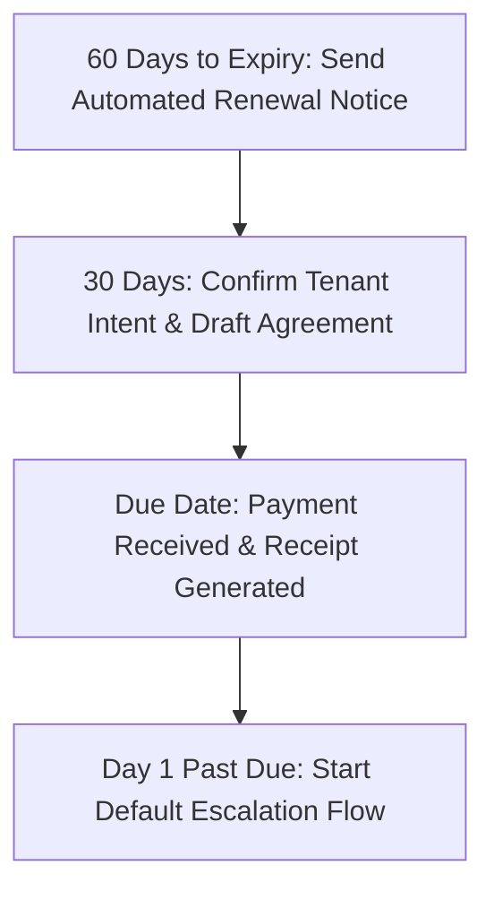

# MODULE 9: Property Management & After-Sales Excellence

## Handbook 2: Operations, Rent Collection & Renewals

*"Cash flow is the lifeblood of property investment. If rent is not collected, the system fails."*

### Opening Story
An investor owned a portfolio of ten residential flats in Lagos. He managed them himself. He was a kind landlord and often accepted excuses from tenants who asked for "a few extra weeks" to pay their rent. 

Within two years, four tenants were six months behind on rent, two were a year behind, and the others paid at irregular intervals. The landlord could not pay the estate security levies, the waste management bills, or perform necessary building repairs. The estate association shut off power to the building due to unpaid levies. The good tenants packed out, leaving only the defaulting tenants behind.

The investor's dream of retirement cash flow turned into a nightmare of debt and eviction lawsuits.

This occurred because the landlord treated rent collection as a personal favor rather than an operational system.

---

### Learning Objectives
By the end of this handbook, you should be able to:
- Establish a structured, digital rent collection workflow.
- Execute the Housmata default escalation process for late payments.
- Draft and issue legal notices for rent defaults.
- Manage the lease renewal cycle and execute tenant exit inspections.

---

### Lesson 1: The Rent Collection System

Rent collection must be automated and system-based, not manual. A Housmata Advisor uses the **Rent Tracking Module** on the platform to manage payments:

#### Standard Rent Collection Rules:
1. **No Cash Payments:** All payments must be made via bank transfer or online payment links directly into the designated landlord/estate account. This ensures instant digital reconciliation and removes the risk of cash handling errors or employee fraud.
2. **Automated Reminders:** The system sends reminders at 60 days, 30 days, and 7 days before rent expiry.
3. **Grace Period Policy:** Define a clear policy in the tenancy agreement (e.g., maximum 3 days grace period after the due date before penalty charges or notices apply).

---

### Lesson 2: The Default Escalation Flow

When a tenant fails to pay on time, do not ignore it. Follow the **Housmata Escalation Flow** systematically:

#### Day 1 Past Due: The Polite Reminder
Send a friendly email and SMS notification.
- *Template:* *"Dear Mr. Obi, this is a reminder that your rent for Flat 3 expired on [Date]. Please update your payment record online or share the transfer receipt. Thank you."*

#### Day 7 Past Due: The Official Call & Demand Letter
Call the tenant to discuss the delay. Issue an official demand letter requesting payment within 7 days.

#### Day 15 Past Due: The Legal Warning
Advise the landlord to instruct their lawyer to prepare a formal **Letter of Demand** warning of legal action.

#### Day 30 Past Due: Legal Notices (7-Day Notice of Owner's Intention to Apply to Recovery Possession)
Under Nigerian tenancy laws (e.g., the Lagos State Tenancy Law), specific notices must be served before evicting a tenant:
- **Notice to Quit:** Issued depending on the tenancy type (e.g., 6 months' notice for a yearly tenant, 1 month for a monthly tenant).
- **7 Days Notice of Owner's Intention to Apply to Recover Possession:** Served after the Notice to Quit expires.

*Note:* Serving these notices requires strict legal timing. Always coordinate with the landlord's lawyer.

---

### Lesson 3: Lease Renewals & Move-Out Audits

#### The Renewal Cycle
At 60 days before expiry, ask the tenant if they intend to renew. If yes, evaluate:
- Have they paid rent consistently?
- Have they complied with estate rules?
- Does the landlord want to adjust the rent to match inflation?
If approved, generate the renewal agreement and issue the payment invoice.

#### The Move-Out Audit (Tenant Exit)
If the tenant is leaving, conduct a **Move-Out Inspection**:
1. Walk the property with the tenant using the original **Move-In Inventory Report** as a baseline.
2. Document any damages beyond normal wear and tear (e.g., broken doors, damaged sinks, stained walls).
3. Calculate the repair costs and deduct them from the tenant's **Caution Deposit** before returning the balance.

---

### Case Study: The Caution Deposit Shield

> [!NOTE]
> **Scenario:** A tenant moved out of a 2-bedroom apartment. He demanded the immediate refund of his ₦200,000 caution deposit. He claimed the apartment was in "perfect condition."
> 
> The Housmata Advisor conducted the move-out inspection. 
> 
> **The Audit:** The advisor found that the tenant had painted the bedroom walls black without permission, broken the bathroom mirror, and left an outstanding electricity bill of ₦45,000.
> 
> **Action:** The advisor obtained quotes for painting (₦80,000) and mirror replacement (₦15,000). 
> 
> **Outcome:** The advisor deducted ₦140,000 (repairs + utility bill) from the caution deposit and returned the balance of ₦60,000 to the tenant, accompanied by receipt receipts. The landlord did not spend a single Naira of his own on repairs.
> 
> **Lesson:** A caution deposit is not a bonus fee; it is your shield against property damage and unpaid utility bills.

---

### Chapter Summary
- Rent collection must be digital, tracked, and backed by automated reminders.
- Escalation for defaults must begin on Day 1, not Month 3.
- Enforcing tenancy rules requires strict compliance with local tenancy laws.
- Exit inspections and caution deposits protect the landlord's asset value.

---

### End-of-Chapter Reflection
*If a tenant calls you crying that they lost their job and cannot pay rent for the next 3 months, how do you handle the situation professionally while protecting the landlord's interest?* Write down your mediation strategy.
