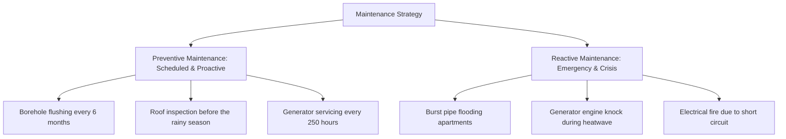

# MODULE 9: Property Management & After-Sales Excellence

## Handbook 3: Maintenance Coordination & Investor Reporting

*"Maintenance preserves the building; reporting preserves the investor."*

### Opening Story
A real estate investor owned three apartment buildings in Abuja, worth ₦300 million. He rarely visited the properties, relying on his manager to run them. Every year, the manager sent a brief email saying: *"All is well, the tenants are happy, and the money has been sent to your bank."*

After five years, the investor decided to sell one of the buildings. He hired an independent valuer to inspect it. The valuer's report was shocking: the roof structure was rotting due to unchecked leaks, the sewage system was cracked and leaking into the borehole water supply, and the electrical panels were fire hazards. The property was valued at only ₦70 million, down from its potential ₦100 million.

The manager had ignored **preventive maintenance** to show short-term profits.

The investor lost ₦30 million in asset value because he had no transparent reporting or maintenance coordination.

---

### Learning Objectives
By the end of this handbook, you should be able to:
- Establish a maintenance ticketing system to track and resolve property issues.
- Differentiate between and implement Preventive and Reactive Maintenance strategies.
- Manage and vet third-party vendors using Service Level Agreements (SLAs).
- Prepare transparent, data-driven Portfolio Reports for property investors.

---

### Lesson 1: Preventive vs. Reactive Maintenance

Property maintenance falls into two categories. Successful managers focus on the first to prevent the second:

- **Preventive Maintenance (The Shield):** Scheduled, routine checks and servicing designed to prevent failures. It is cheap, predictable, and extends the asset's lifespan. By checking the roof, generator, or plumbing regularly, you find small issues before they become major emergencies.
- **Reactive Maintenance (The Crisis):** Fixing components after they break. It is expensive, causes tenant frustration, and damages the building's structure.

*Rule:* For every ₦1 spent on preventive maintenance, you save ₦5 in future reactive repairs.

---

### Lesson 2: The Maintenance Ticket & Vendor System

When a tenant reports a problem, it must be logged as a **Maintenance Ticket** in the Housmata platform:

#### 1. Logging and Priority Assignment
Categorize tickets by urgency:
- **Emergency (2-hour response):** Gas leaks, major electrical faults, burst water mains, security breaches.
- **Urgent (24-hour response):** Broken water pump, toilet blockage, AC failure in master bedroom.
- **Routine (3-5 day response):** Loose cupboard door hinge, minor paint peeling, gate remote repair.

#### 2. Service Level Agreements (SLAs) with Vendors
Do not hire random artisans from the street. Work with vetted, insured vendors (plumbers, electricians, builders) who sign an SLA:
- **Response Time:** Vendor must arrive within the ticket priority window.
- **Quality of Materials:** Vetted materials must be used. No cheap counterfeits.
- **Fixed Pricing:** Agreed labor rates to prevent over-billing.
- **Warranty:** A minimum 3-month warranty on all repairs.

---

### Lesson 3: Investor & Portfolio Reporting

High-net-worth investors and diaspora landlords require professional reporting. You must send them a **Quarterly Portfolio Report** showing their asset performance.

#### Core Metrics to Report:
- **Occupancy Rate:** The percentage of rented units (e.g., 90% occupancy means 9 out of 10 flats are rented).
- **Gross Rental Income:** Total rent collected.
- **Operating Expenses (OPEX):** Total spent on maintenance, security, estate levies, and management fees.
- **Net Operating Income (NOI):** Gross Income minus OPEX.
- **Net Rental Yield:** $\text{NOI} / \text{Property Acquisition Cost}$.
- **Capital Appreciation Trend:** Estimated increase in the building's market value.

---

### Case Study: The Transparent Quarterly Report

> [!NOTE]
> **Scenario:** Mr. Tony, an investor in London, received a quarterly report from his Housmata Advisor for his 4-flat property in Ibadan. The report showed:
> - Gross Rent Collected: ₦8 million.
> - OPEX: ₦1.2 million (including a ₦200,000 scheduled roof-treatment project).
> - Net Income: ₦6.8 million.
> - Occupancy: 100%.
> - Attachment: Photos of the completed roof treatment and plumbing audits.
> 
> **Outcome:** Mr. Tony was delighted. Even though he spent ₦200,000 on the roof, the report proved the expenditure preserved his building's value and prevented future ceiling damage.
> 
> **Result:** Two weeks later, Mr. Tony sent another ₦150 million to the Advisor to purchase a second property.
> 
> **Lesson:** Investors do not mind spending money on maintenance if you show them transparent reports, receipts, and proof of value preservation.

---

### Chapter Summary
- Preventive maintenance is cheaper and more strategic than reactive repairs.
- Vetted vendors must be managed using strict Service Level Agreements (SLAs).
- Maintenance tickets must be categorized and resolved based on priority.
- Investor reports must be sent quarterly, detailing Occupancy, OPEX, NOI, and yield trends.

---

### End-of-Chapter Reflection
*Create a mock quarterly report for a landlord who owns a duplex in Lagos. Include a ₦150,000 plumbing repair expense, calculate the Net Operating Income, and write a summary recommendation for a generator service plan.* Record this in your journal.
